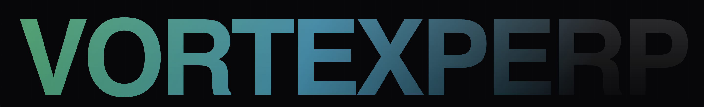

# VortexPerp



**Live Demo:** [https://vortex-perp.vercel.app/](https://vortex-perp.vercel.app/)

VortexPerp is a decentralized, virtual Automated Market Maker (vAMM) perpetual futures exchange deployed on the Solana Devnet. The protocol enables users to trade perpetual contracts with leverage in a fully decentralized and non-custodial environment.

## Architecture Overview

The protocol is composed of three primary layers:

1. **Smart Contracts (Solana Program)**
   Built using the Anchor framework, the on-chain program manages state, validates margin requirements, executes liquidations, and handles the vAMM pricing curve (x * y = k).
   - Language: Rust
   - Framework: Anchor

2. **TypeScript SDK**
   A robust client SDK for interacting with the on-chain protocol. The SDK simplifies account derivation, instruction building, and transaction formatting.
   - Language: TypeScript
   - Dependencies: @solana/web3.js, @coral-xyz/anchor

3. **Web Application Interface**
   A highly responsive and aesthetically refined front-end built with Next.js. It integrates directly with the Pyth Network for real-time oracle pricing and TradingView for professional charting.
   - Framework: Next.js (React)
   - Styling: Vanilla CSS
   - Wallet Integration: Solana Wallet Adapter

## Protocol Mechanics

### Virtual Automated Market Maker (vAMM)
VortexPerp utilizes a vAMM model. Unlike traditional order book exchanges or standard AMMs, the vAMM does not require deep liquidity pools for trading. The pricing mechanism operates mathematically along a constant product curve, adjusting dynamically based on trader positioning (Open Interest).

### Pricing and Oracles
The protocol integrates Pyth Network oracles to provide high-fidelity, sub-second latency price feeds. Pyth's Push Oracle model ensures that liquidations and settlements are executed against accurate off-chain market data.

### Margin and Liquidations
Traders post collateral (margin) to open leveraged positions. If the mark price moves against the trader and their position equity falls below the maintenance margin threshold, the position becomes eligible for liquidation by third-party keepers.

## Repository Structure

- `programs/vortex-perp`: The Anchor smart contract source code.
- `sdk/`: The TypeScript client library.
- `app/`: The Next.js front-end application.
- `tests/`: Integration tests for the Anchor program.

## Local Development

### Prerequisites
- Node.js (v18+)
- pnpm
- Rust and Cargo
- Solana CLI
- Anchor CLI

### Installation

1. Install dependencies across the workspace:
   ```bash
   pnpm install
   ```

2. Build the Anchor program and generate the IDL:
   ```bash
   anchor build
   ```

3. Run the development server:
   ```bash
   pnpm --filter @vortex-perp/app run dev
   ```

## Disclaimer
This project was developed as a capstone implementation. The smart contracts have not been formally audited and are deployed exclusively to the Solana Devnet for demonstration purposes. Do not deposit real assets.
